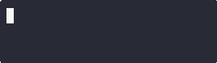

<!--
SPDX-FileCopyrightText: 2025 GSI Helmholtzzentrum für Schwerionenforschung GmbH <https://www.gsi.de/en/>

SPDX-License-Identifier: LGPL-3.0-only
-->

## Personal notes while learning Go

This is a random collection of small Go programs that demonstrate building
blocks I was researching while learning the Go language.

Primarily for my own notes, but happy to share for your interest :)

### Build

Build the programs and screencasts via

```console
git clone https://github.com/dennisklein/go-lessons
cd go-lessons
docker buildx bake
```

Build artifacts are written to `_out/`.

### 1. Typical project structure

```
├── cmd
│   └── <exename>
│       └── *.go  <-- Needs "package main"
├── go.mod
├── pkg
│   └── <pkgname>
│       └── *.go  <-- Needs "package <pkgname>"
└── README.md
```

* Generate `go.mod` via `go mod init <modulename>`
   * `<modulename>` typically github url, e.g. for this module
     `github.com/dennisklein/go-lessons`
* Update `go.mod` via `go mod tidy` after changing import statements in source
  files
* Import packages from `pkg` directory via
  ```go
  import "<modulename>/pkg/<pkgname>"
  ```
* Build via `go build ./...`
* Release by tagging with a semantic version, e.g. `v1.3.14`
   * Versions below `v1.0.0` are considered unstable

### 2. Simple executable



[`cmd/cli/main.go`](cmd/cli/main.go)
